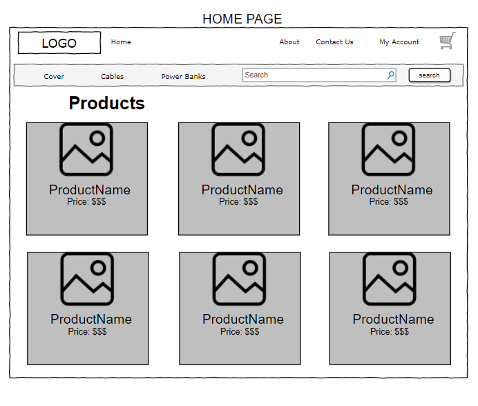
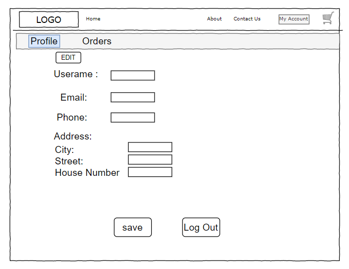
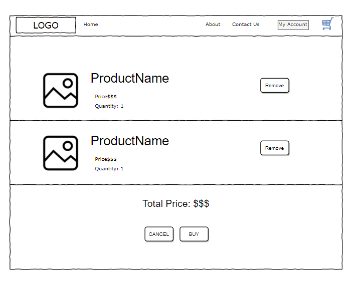
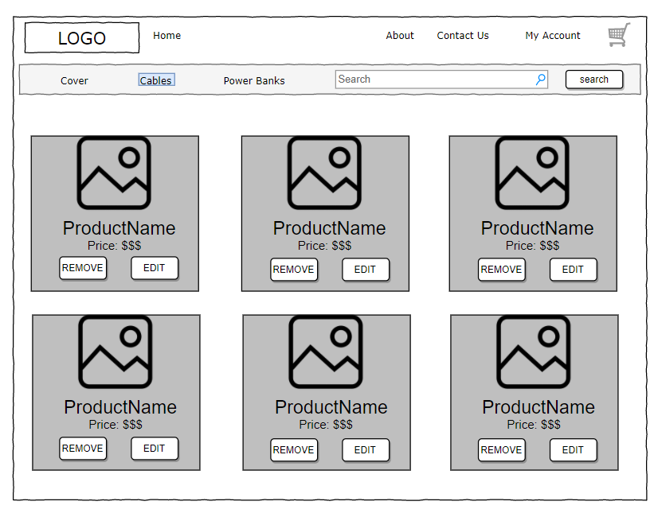
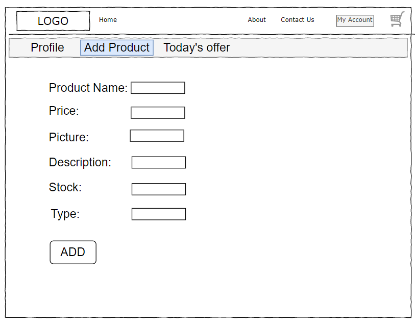

# Tech Shopping Website (PROJECT 3)
This project is about a **tech and accessories shopping website**, where users can browse and search about the products we have, register and login, edit their profile with addresses and purchase products.

# Team Members:
This project was done by: 
- Mohammed Rashed @mhmd
- Najd Alhadmol @najd
- Raghad Abu-mansur @raghadm7md
- Meshal Alotaibi @meshalalotaibi94

## Technologies Used
This project was built using:
- HTML, CSS, JavaScript.
- ReactJS
- Bootstrap
- Axios
- Express
- MongoDB
- Mongoose
- Node.js

## Wireframes
**Here are simple photos showcasing the wireframe of the project.**

- ### Homepage:

- ### Profile:

- ### Cart page:

- ### Admin Page:

- ### Add products Page:

-------

## User Stories
User Stories:
- As a user, I should be able to sign in and sign out. 
- As a user, I should be able to search for products using the search bar and get the results.
- As a user, I should be able to add products that I searched for to my cart. 
- As a user, I should be able to see products that I purchased on my order list.
- As a user, I should be to see a deals going on on the home page including the product's name, picture, and the offer.
- As a user, I should be able to know when did I purchased the product.
- As a user, I should be able to change the quantity of the product inside my cart. 

Admin Stories:
- As an Admin, I should be able to add or delete products.

 

# Future Updates and Iterations
There are more features that can be done to this website to make it more useful and meet users' needs. Some ideas: 
+ <b>Home Page:</b> Improvements can be done to the homepage too, some ideas: 
    + Homepage should include the products that have sales going right now. 
    + it should include pictures and the prices for the products

+ <b>More Admin control</b> :
    + Adding the ability delete users. 
    + Adding the ability to contorl the offers and make sales.
    + Adding the ability to change the homepage.

+ <b>Website Styling:</b> An overall updates to the looks of the website. 

 

-------

# Conclusion 

## Reference
- [Bootstrap Download](https://getbootstrap.com/)
- [ReactJS](https://reactjs.org/)
- [React Bootstrap](https://react-bootstrap.github.io/)
- [Bootstrap Grid Templates](https://getbootstrap.com/docs/4.0/examples/grid/)
- [Bootstrap Cards](https://getbootstrap.com/docs/5.0/components/card/)
- [Bootstrap Forms](https://getbootstrap.com/docs/5.0/forms/overview/)
- [cheapshark API](https://apidocs.cheapshark.com/#c33f57dd-3bb3-3b1f-c454-08cab413a115)
- [mdbootstrap](https://mdbootstrap.com/docs/standard/forms/input-fields/)

